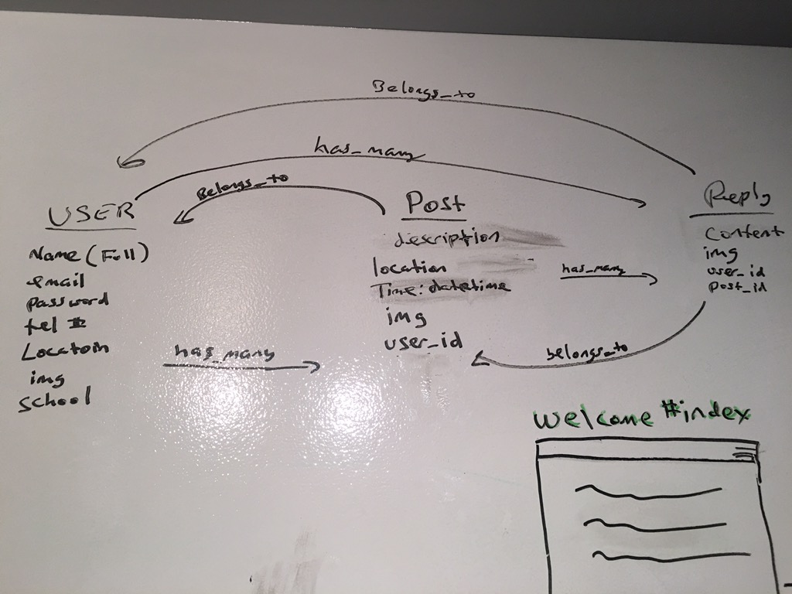
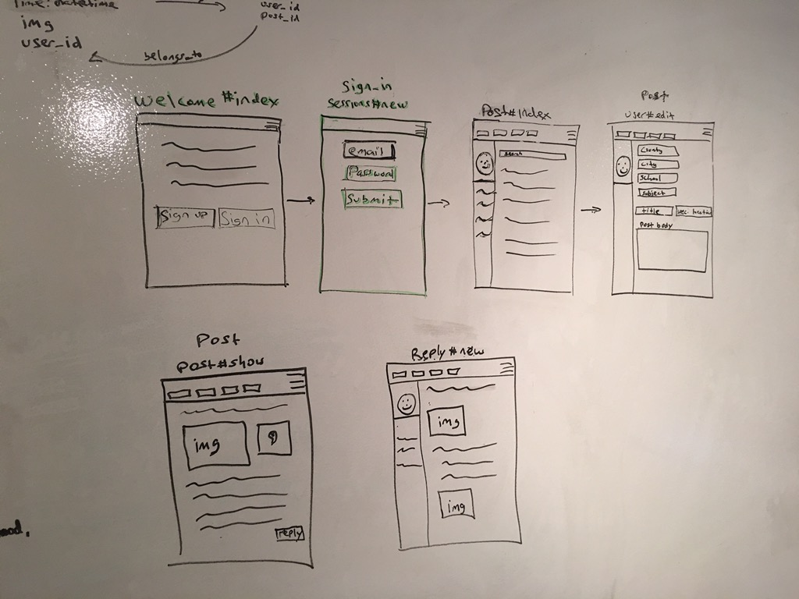

# Help.me

trello link: https://trello.com/b/YOPPDAi1/help-me

This app will allow students to list the areas of study they need a little extra help with. Users will be able to log in, post the subject and actual problem, and suggest a meet up time and location if needed. This post will be visible to other users at their school, who will be able to respond with a answer to this problem and if needed accept their location and time for a meetup to further assist.

